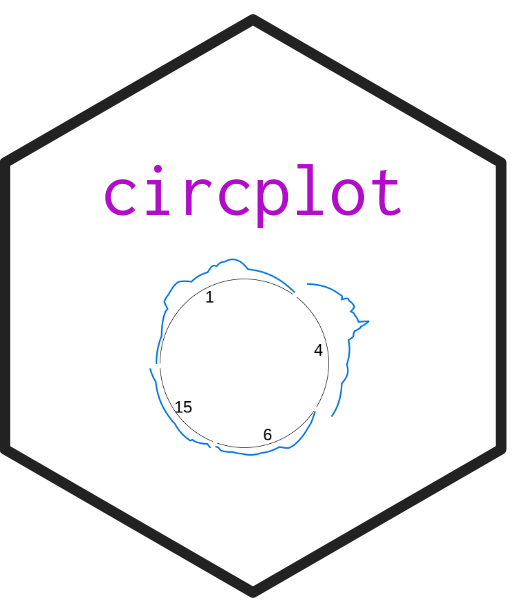
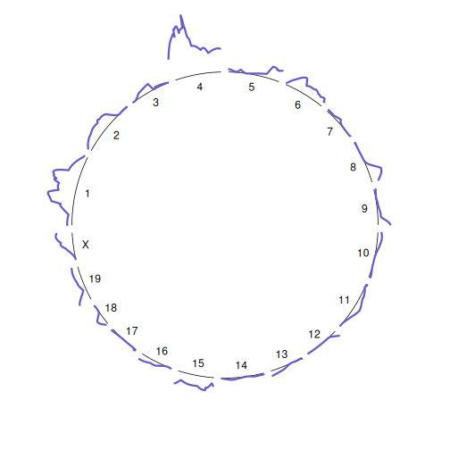
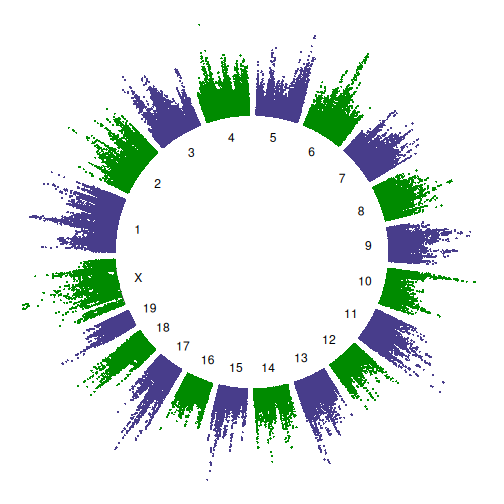

## circplot <a href="https://github.com/kbroman/circplot"></a>

[](https://github.com/kbroman/circplot/actions/workflows/R-CMD-check.yaml)
[](https://kbroman.r-universe.dev/circplot)
[](https://doi.org/10.5281/zenodo.20097110)

R package to facilitate making plots as circles.

Created this for the function `plot_scan1_circ()`, for plotting a genome scan
as a circle, and for making fun of circle plots.

---

### Installation

Install circplot from
[R-universe](https://kbroman.r-universe.dev/circplot):


``` r
install.packages("circplot", repos=c("https://kbroman.r-universe.dev",
                                     "https://cloud.r-project.org"))
```

Or install it from github using the [remotes](https://remotes.r-lib.org)
package:


``` r
install.packages("remotes")
library(remotes)
install_github("kbroman/circplot")
```

---

### Usage

The function `xy2circ()` converts (x,y) coordiates to circular
coordinates. It is used internally in the function
`plot_scan1_circ()`.


``` r
library(circplot)
library(qtl)
suppressMessages(library(qtl2))
data(hyper)
hyper <- convert2cross2(hyper)

map <- insert_pseudomarkers(hyper$gmap, step=0.2)
pr <- calc_genoprob(hyper, map, err=0.01)
out <- scan1(pr, hyper$pheno)

par(mar=rep(0,4))
plot_scan1_circ(out, map, lwd=3, rlim=c(5,7))
```



You can also use `plot_scan1_circ()` to plot SNP association scans.
Use `altcol` to have chromosomes plotted in alternating colors.


``` r
file <- paste0("https://raw.githubusercontent.com/rqtl/",
               "qtl2data/main/DO_Gatti2014/do.zip")
do <- read_cross2(file)

pr <- calc_genoprob(do, err=0.002, cores=0)
k <- calc_kinship(pr, "loco", cores=0)

variantdb <- "~/Data/CCdb/cc_variants.sqlite"
query_variants <- create_variant_query_func(variantdb)

out <- scan1spnps(pr, do$pmap, do$pheno[,1], k,
                  query_func=query_variants, cores=0,
                  Xcovar=get_x_covar(do))
```


``` r
lod <- out$lod
map <- qtl2:::snpinfo_to_map(out$snpinfo)

par(mar=rep(0,4))
plot_scan1_circ(lod, map, rlim=c(4,7),
                col="darkslateblue", altcol="green4",
                type="p", cex=0.4)
```



---

### License

Licensed under [GPL-3](https://www.r-project.org/Licenses/GPL-3).
